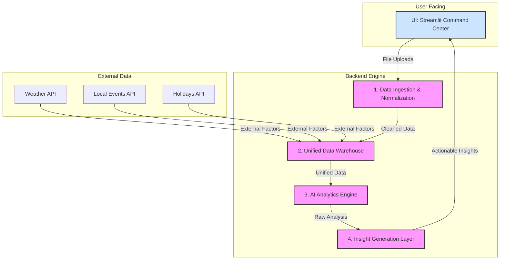

# The Vision: The Restaurant OS Command Center

Our goal is to create a tool that feels less like a dashboard and more like an automated business partner. It will ingest the messy, disconnected data from a restaurant's various systems (POS, inventory, supplier sheets) and transform it into a clear, forward-looking action plan.

The core philosophy is **"Insight, then Action."** We don't just show data; we interpret it and provide concrete, prioritized recommendations that a busy owner can implement immediately to boost their bottom line.

### System Architecture

---

### Architectural Components in Detail

#### 1. Data Ingestion & Normalization (The "Magic" Input)

This is our first and most critical moat. We must handle real-world, messy data flawlessly.

*   **Enhanced `AIExcelParser`:** We'll upgrade the existing parser to use fuzzy matching (e.g., `Levenshtein distance`) to automatically reconcile different naming conventions ("Tomato", "Tomatoes", "Tomate").
*   **Data Type Auto-Detection:** Continue to refine the logic that identifies files as "Sales," "Inventory," "Supplier," etc.
*   **Normalization Service:** A new module that standardizes data formats (especially dates and currency) and creates unique, consistent IDs for menu items and ingredients across all datasets.

#### 2. Unified Data Warehouse (The Single Source of Truth)

The current in-memory `RestaurantDataWarehouse` is a good start. We will formalize it.

*   **Schema:** Define clear schemas for `Sales`, `Inventory`, `Recipes`, `Suppliers`, `Weather`, and `Events`.
*   **Relational Mapping:** The warehouse will be responsible for creating and storing the relationships between data points (e.g., this `sale` of a "Classic Burger" decremented these `ingredients` from `inventory`).
*   **Technology:** While the current implementation uses in-memory dictionaries, we should migrate to the `sqlite3` database that's already imported. This provides persistence, scalability, and the ability to perform complex queries efficiently.

#### 3. AI Analytics Engine (The "Brains")

This is where we generate the core analytical output. It will be composed of several specialized modules:

*   **Menu Engineering Module:**
    *   Calculates profitability and popularity for every menu item.
    *   Classifies items into the classic four quadrants: **Stars** (High Profit, High Pop), **Plow-horses** (Low Profit, High Pop), **Puzzles** (High Profit, Low Pop), and **Dogs** (Low Profit, Low Pop).
*   **Inventory & Operations Module:**
    *   Calculates sales velocity for every item.
    *   Predicts inventory needs and flags **Stockout Risks**.
    *   Identifies **Overstocked Items** that are tying up capital.
    *   Generates optimized reorder lists, suggesting quantities and timing.
*   **Demand Forecasting Module:**
    *   Uses historical sales data as a baseline.
    *   Integrates with the external Weather, Events, and Holidays APIs to create a powerful time-series forecasting model.
    *   This model will predict future revenue and guest count on a daily and even hourly basis.

#### 4. Insight Generation Layer (The "So What?" Layer)

This is what makes the product feel intelligent and indispensable. This layer, likely powered by an LLM, will translate the raw analysis from the engine into actionable advice.

*   **From:** "Caesar Salad is a Plow-horse."
*   **To:** "💡 **Profit Opportunity:** Your Caesar Salad is very popular but has a low profit margin. **Recommendation:** Increase the price by $1.50 or try sourcing a more cost-effective dressing to boost its profit by an estimated $350/month."

### The "Swoon-Worthy" UI Command Center

The UI must be clean, intuitive, and action-oriented.

*   **The Main Dashboard:** The first screen a user sees.
    *   **Top-Line KPIs:** Today's Forecasted vs. Actual Revenue, Weekly Profit Trend, Customer Count.
    *   **"Your Top 3 Actions for Today":** A dynamic list of the most impactful recommendations from the Insight Layer (e.g., "1. Order more burger buns," "2. Promote the Truffle Pasta special," "3. Staff an extra server for the expected dinner rush.").
*   **Menu Deep Dive:**
    *   A visual, interactive 4-quadrant chart of all menu items.
    *   Users can click on any item to see a full breakdown: cost, price, margin, sales history, and specific recommendations.
*   **Inventory Hub:**
    *   **"Smart" Shopping List:** An auto-generated purchase order based on sales velocity and stock levels.
    *   **Alerts:** Clear sections for "At-Risk of Stockout" and "Overstocked" items.
*   **Forecasting Calendar:**
    *   A simple calendar view showing predicted revenue for the next 14-30 days.
    *   Days are color-coded (e.g., green for busy, red for slow).
    *   Hovering over a day reveals the "why" behind the forecast (e.g., "🌧️ Rain expected," "🏈 Major sports game nearby").